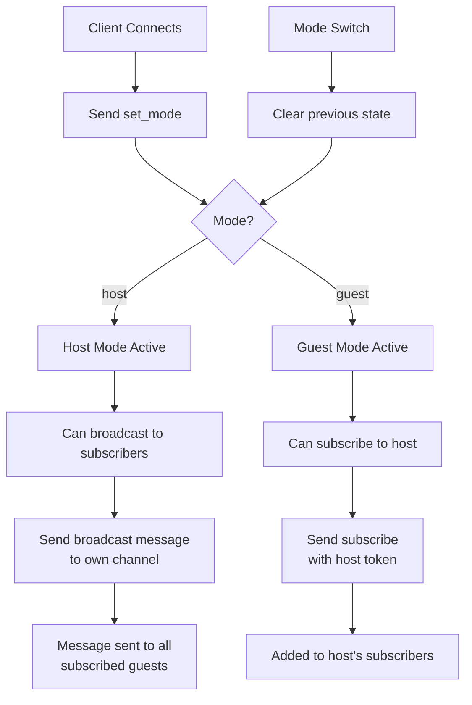

# Host/Guest Mode and Subscription System Implementation Plan

## Current System Analysis
The existing WebSocket proxy (`server.js`) provides:
- Client connections with UUID generation based on IP
- Short token assignment for client identification (via `tokenManager.js`)
- Direct messaging between clients using short tokens
- No subscription or broadcast capabilities

## Requirements Summary
1. **Client Modes**: Each client can be in `host` or `guest` mode
2. **Channel Subscription**: Guests can subscribe to a host's channel using the host's short token
3. **Broadcast**: Hosts can broadcast messages to all subscribed guests by sending to their own channel ID
4. **Mode Switching**: Clients can switch modes dynamically; switching clears previous mode's state
5. **Single Subscription**: A guest can only be subscribed to one channel at a time
6. **Message Types**: New message types for mode management, subscriptions, and broadcasts

## Architecture Design

### Data Structures to Add
1. **Client State Extension** (in `activeConnections`):
   - `mode`: 'host' | 'guest' | null
   - `subscribedTo`: shortToken of host (for guests)
   - `subscribers`: Set of guest shortTokens (for hosts)

2. **Subscription Management**:
   - Host → Set of guest shortTokens
   - Guest → host shortToken (single)

### Message Flow


## Implementation Steps

### Phase 1: Extend Data Structures and Client State
1. **Modify `server.js` client connection storage**:
   - Extend `activeConnections` to store client mode and subscription info
   - Add `mode`, `subscribedTo`, `subscribers` fields to connection objects

2. **Update `tokenManager.js`** (optional):
   - Consider adding helper methods for subscription management
   - Or keep subscription logic in `server.js` for simplicity

### Phase 2: Implement New Message Types
3. **Add message type handling in `server.js`**:
   - `set_mode`: {type: 'set_mode', mode: 'host'/'guest'}
   - `subscribe`: {type: 'subscribe', to: hostShortToken}
   - `unsubscribe`: {type: 'unsubscribe'}
   - `broadcast`: {type: 'broadcast', message: content} (host sends to own channel)

4. **Extend existing message validation**:
   - Update message validation to handle new message types
   - Maintain backward compatibility with existing direct messaging

### Phase 3: Implement Subscription Logic
5. **Implement `subscribe` handler**:
   - Validate guest is in guest mode
   - Validate host exists and is in host mode
   - Unsubscribe from previous host if already subscribed
   - Add guest to host's subscribers
   - Send confirmation to both guest and host

6. **Implement `unsubscribe` handler**:
   - Remove guest from host's subscribers
   - Clear guest's subscription

### Phase 4: Implement Broadcast Logic
7. **Modify message routing logic**:
   - When a host sends a message to their own short token, treat as broadcast
   - Send message to all subscribed guests
   - Maintain existing direct messaging for other short tokens

8. **Implement broadcast message format**:
   - Include sender's short token
   - Include timestamp
   - Type: 'broadcast_message'

### Phase 5: Implement Mode Management
9. **Implement `set_mode` handler**:
   - Validate mode is 'host' or 'guest'
   - Clear existing state (unsubscribe if guest, clear subscribers if host)
   - Update client mode
   - Send confirmation

10. **Handle mode switching on connection close**:
    - Clean up subscriptions when client disconnects
    - Remove from host's subscribers if guest
    - Notify host of guest departure

### Phase 6: Error Handling and Validation
11. **Add comprehensive error handling**:
    - Validate client mode for each operation
    - Validate subscription states
    - Handle edge cases (host disconnects, invalid tokens)

12. **Add status reporting**:
    - Extend `/status` endpoint to show mode statistics
    - Show subscription counts per host

### Phase 7: Testing and Documentation
13. **Create test scripts**:
    - Test host/guest mode switching
    - Test subscription flow
    - Test broadcast functionality

14. **Update documentation**:
    - Document new message types
    - Document API changes
    - Update README with new features

## Detailed Implementation Notes

### Message Format Examples
```json
// Set mode
{
  "type": "set_mode",
  "mode": "host"  // or "guest"
}

// Subscribe to host
{
  "type": "subscribe",
  "to": "ABC123"  // host's short token
}

// Unsubscribe
{
  "type": "unsubscribe"
}

// Broadcast (host sends to own token)
{
  "to": "ABC123",  // host's own short token
  "message": "Hello all guests!"
}

// Broadcast message received by guests
{
  "type": "broadcast_message",
  "from": "ABC123",
  "message": "Hello all guests!",
  "timestamp": "2026-02-28T04:52:33.897Z"
}
```

### State Management Rules
1. **Mode Persistence**: Mode is stored per connection, not per UUID
2. **Subscription Limits**: Guest can only subscribe to one host at a time
3. **Auto-cleanup**: Subscriptions automatically cleaned up on disconnect
4. **Mode Switching**: Switching modes clears all related state
5. **Host Disconnection**: All guests automatically unsubscribed when host disconnects

### Backward Compatibility
- Existing direct messaging remains unchanged
- Clients without mode set default to no mode (can only use direct messaging)
- New features are opt-in via message types

## Files to Modify
1. **`server.js`** - Main implementation (message handlers, state management)
2. **`tokenManager.js`** - Optional extensions for subscription helpers
3. **`README.md`** - Documentation updates
4. **Create `testSubscription.js`** - New test script

## Success Criteria
- Hosts can broadcast to all subscribed guests
- Guests can subscribe/unsubscribe from hosts
- Mode switching works correctly
- No breaking changes to existing functionality
- Proper error handling for invalid operations
- Clean state management and memory cleanup